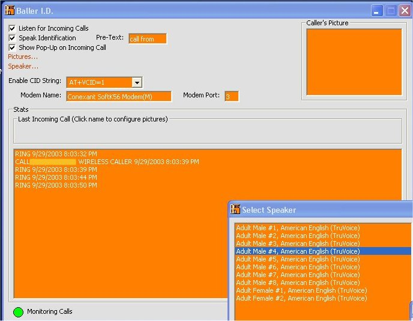



## Caller I\.D\.

### Description

This is everything you could ask for in a caller id program. This will monitor your incoming calls and display them if you have caller id and if your modem supports caller id. You can select a picture for the person calling. This will also speak if desired when a person calls and save all your calls. You will need the text-to-speech engine which you can get from http://www.microsoft.com/msagent/downloads/user.asp#tts. I've seen things way worse than this cost alot of money, so take advantage of this source. This is just a beta version. Most things have been tested. Please send any of your feedback or information to improve this source to keith_escalade@yahoo.com or pm me on AIM: kescalade1
 
### More Info
 

             |
---                |---
**Submitted On**   |2003-10-01 16:00:40
**By**             |[keith\_escalade](https://github.com/Planet-Source-Code/PSCIndex/blob/master/ByAuthor/keith-escalade.md)
**Level**          |Advanced
**User Rating**    |4.3 (56 globes from 13 users)
**Compatibility**  |VB 6\.0
**Category**       |[Miscellaneous](https://github.com/Planet-Source-Code/PSCIndex/blob/master/ByCategory/miscellaneous__1-1.md)
**World**          |[Visual Basic](https://github.com/Planet-Source-Code/PSCIndex/blob/master/ByWorld/visual-basic.md)
**Archive File**   |[Caller\_I\_D1652971022003\.zip](https://github.com/Planet-Source-Code/keith-escalade-caller-i-d__1-48942/archive/master.zip)

